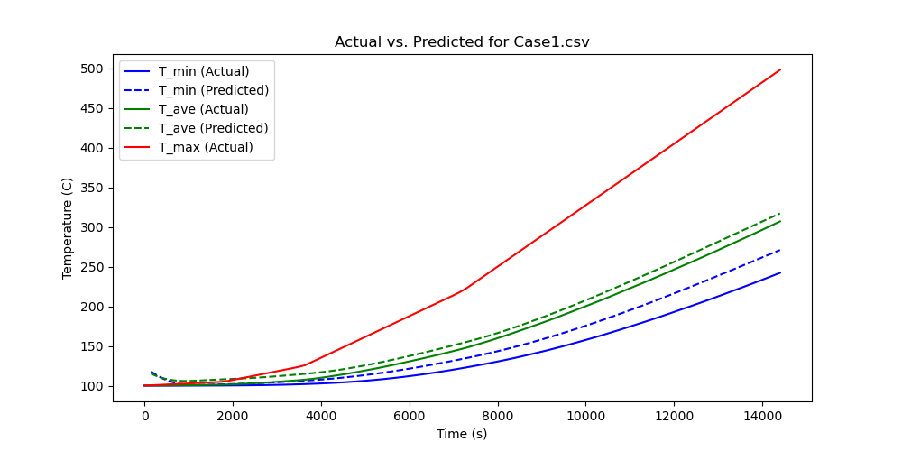
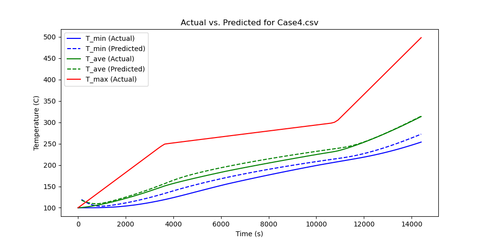

# Machine Learning Research for Thermal Energy Storage

## Purpose
Simulations for thermal energy storage charging and discharging are widely used to predict costs, time requirements, and energy outcomes for various systems. However, these simulations are computationally intensive and slow. By leveraging time-sequential machine learning models, we aim to develop faster and more efficient alternatives while maintaining accuracy.

## Models
The following models were tested, each with a brief description:

- **Long Short-Term Memory (LSTM):** A type of recurrent neural network (RNN) designed to handle long-term dependencies by mitigating the vanishing gradient problem, making it effective for sequential data modeling.
- **Gated Recurrent Unit (GRU):** A simplified variant of LSTM that reduces computational complexity while maintaining performance, particularly well-suited for time-series forecasting.
- **Recurrent Neural Network (RNN):** A fundamental neural network architecture for sequential data, though prone to vanishing gradients, limiting its ability to capture long-range dependencies.
- **Radial Basis Function Recurrent Neural Network (RBF-RNN):** A hybrid approach integrating radial basis functions into RNNs to enhance pattern recognition and approximation capabilities for time-dependent data.

## Model Results
All model results are available in the `results` folder. We tested five cases with thermal input patterns that differ significantly from the training data to assess whether the models capture the underlying physical behaviors of thermal energy dynamics rather than merely interpolating from training data. This ensures robustness against real-world thermal variations. Below are two example results from the GRU model, where initial predictions are slightly off, likely due to the chosen loss function.

Below is a table of training and testing times. At this stage, testing times are more relevant, as training occurs only once. Additionally, since the feature set is currently limited, the recorded times are less critical than they will be in future iterations. That said, all models complete testing in under a second—significantly faster than traditional simulations, which can take approximately 10 minutes.

| Model                   | GRU  | LSTM | RBF-RNN | RNN  |
|-------------------------|------|------|---------|------|
| **Training Time (s)**   | 60   | 58   | 122     | 49   |
| **Average Testing Time (s)** | 0.084 | 0.067 | 0.13    | 0.07 |

## Status
This research is ongoing, with discharge patterns yet to be trained or tested. Expanding the dataset with a broader range of features will be essential for developing models that generalize well across different simulation scenarios. As the feature space grows, dimensionality reduction techniques will become crucial for maintaining efficiency. Future research will further explore ensemble models and feature reduction strategies.

Currently, we have tested an RBF ensemble over an RNN, but other models may also benefit from similar ensemble techniques. Data availability remains a limitation, and automating real-world data generation through scripted API calls to thermal energy simulation software is the next major step.

Despite these challenges, the implemented models already demonstrate strong performance. For existing thermal energy storage systems, sensor data can be used to fine-tune these models. Given a consistent thermal input type and fixed material properties, machine learning models can better align with real-world physical constraints than simulated environments, which often fail to capture all real-world complexities. Preliminary results indicate that GRU-based predictions are the most accurate, and all models can process thermal input patterns in under a second with adequate hardware—dramatically faster than the current 10-minute simulation runtime.